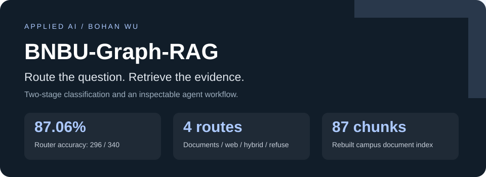
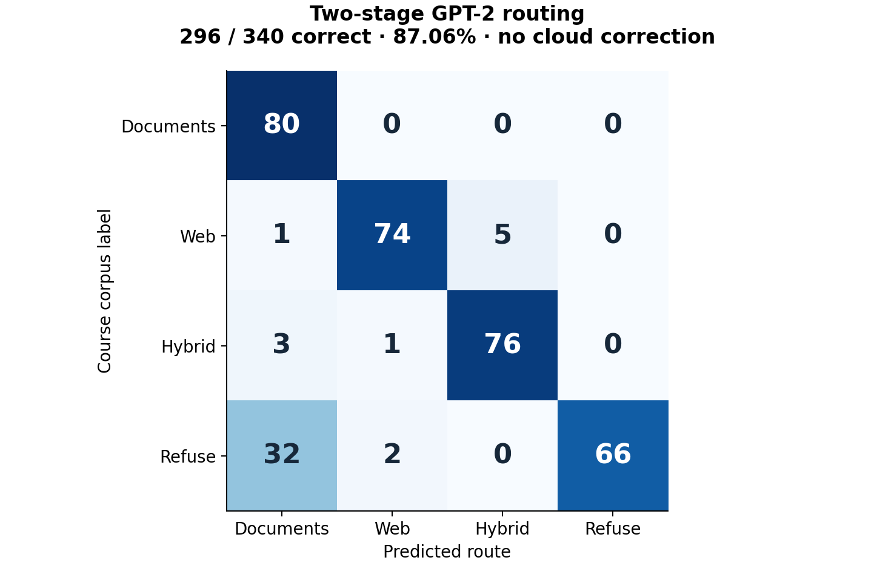
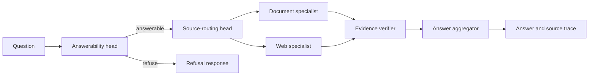
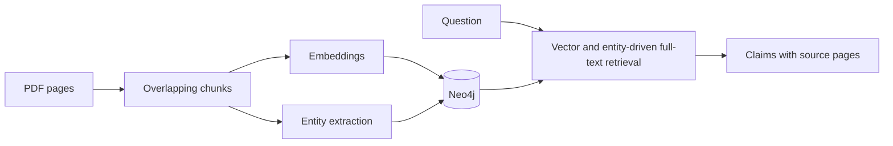

<p align="center"></p>

<p align="center"><b>Campus questions, routed to the right evidence.</b><br>GPT-2 · Neo4j · Ollama · LangChain · Streamlit</p>
<p align="center"><a href="README.zh-CN.md">简体中文</a> · <a href="#quick-start">Quick start</a> · <a href="docs/EVALUATION.md">Evaluation</a> · <a href="THIRD_PARTY.md">Attribution</a></p>

BNBU Graph RAG is a multi-agent question-answering system for university information. A fine-tuned, two-stage GPT-2 router selects document retrieval, web search, a combined route, or refusal. Specialists return structured claims and evidence; a verifier and aggregator produce the final answer and an inspectable execution trace.

## Results at a glance

| Result | Setup |
| :--- | :--- |
| **87.06% routing accuracy — 296 / 340** | Saved local router; cloud route correction disabled |
| **4 route outcomes** | `RAG_ONLY`, `WEB_ONLY`, `HYBRID`, `REFUSE` |
| **87 PDF chunks, 768-dimensional vectors** | Rebuilt local knowledge base from two campus PDFs |
| **74 entity nodes** | Entity extraction over 12 selected chunks |
| **Source-page evidence returned in a live run** | Neo4j + local Ollama, with retrieval and answer traces |

Routing accuracy is measured on the existing course evaluation corpus; a disjoint held-out split is not established. The current demonstration database was rebuilt separately from the original course database. [Protocol and artifacts →](docs/EVALUATION.md)



## From question to supported answer



The `HYBRID` route activates both specialists. The router makes a local decision before larger models are used to retrieve, verify, or compose an answer.



The document specialist combines vector search with entity-driven full-text retrieval. The graph stores document–entity links; this release's live answer path uses the full-text route rather than claiming multi-hop graph reasoning.

## A grounded local answer

> **Question:** When does the sample campus library close on weekdays?
>
> **Answer:** The sample campus library closes at 22:00 on weekdays.
>
> **Evidence:** `sample-campus.pdf`, page 1 — from the fictional handbook included with this repository.

The public pipeline preserves source metadata and matches quoted evidence to retrieved text before accepting a citation. [Execution excerpt →](evaluation/public-demo-answer.json)

## My contribution

I led the architecture and implementation of the two-stage router, agent coordination, evidence contracts, verification and aggregation flow, evaluation tooling, and application integration. I adapted the small Graph RAG workflow from **[NevroHelios/rag-agent](https://github.com/NevroHelios/rag-agent)**. The GPT-2 implementation also builds on Sebastian Raschka's educational implementation. Their work is identified in [THIRD_PARTY.md](THIRD_PARTY.md).

## Quick start

Requires Python 3.11, Neo4j 5, and Ollama. Model files are downloaded explicitly from the release and verified with SHA-256.

```bash
git clone https://github.com/CatAlvin/BNBU-Graph-RAG.git
cd BNBU-Graph-RAG
python -m venv .venv
# Activate .venv for your shell, then:
python -m pip install -r requirements.txt
python scripts/download_assets.py
python scripts/check_router.py
```

The router check reproduces the 340-question routing evaluation without a Neo4j server or cloud API key.

For document Q&A:

1. Copy `.env.example` to `.env` and set your Neo4j password. Start your own Neo4j instance, or run `docker compose up -d` with Docker installed.
2. Run `ollama pull llama3.1:8b` and `ollama pull nomic-embed-text:latest`.
3. Put PDFs you want to query in `data/documents/`. A small, explicitly fictional campus handbook is included for a self-contained demonstration.
4. Run the indexer and open the app:

```bash
python scripts/index_documents.py
streamlit run app.py --server.address 127.0.0.1
```

The app offers automatic routing, document-only Q&A, and local router inspection. Web/hybrid routes additionally require a Tavily key; cloud synthesis or route correction is separately configurable. Environment values are read locally and are never embedded in the UI or published artifacts.

## Explore the implementation

| Module | Responsibility |
| :--- | :--- |
| [`GPT2_router.py`](GPT2_router.py) | Two classifier heads, training, confidence thresholds |
| [`agents/orchestrator.py`](agents/orchestrator.py) | Route dispatch and execution trace |
| [`agents/rag_specialist_agent.py`](agents/rag_specialist_agent.py) | Retrieval, claims, and page evidence |
| [`agents/verifier_agent.py`](agents/verifier_agent.py) | Structured evidence review |
| [`agents/aggregator_judge_agent.py`](agents/aggregator_judge_agent.py) | Source selection and final composition |
| [`eval/val_large.json`](eval/val_large.json) | Published routing questions and labels |

The repository ships code, routing evaluation data, figures, and a sample document. Original course reports, private notes, complete chat traces, and credentials are excluded.
